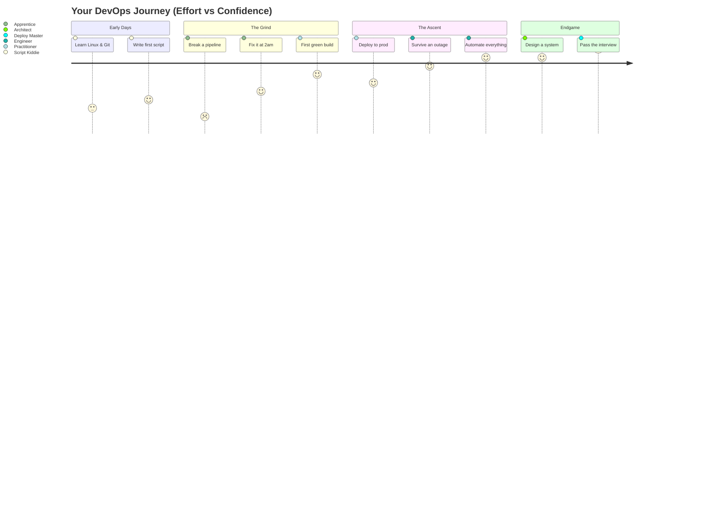
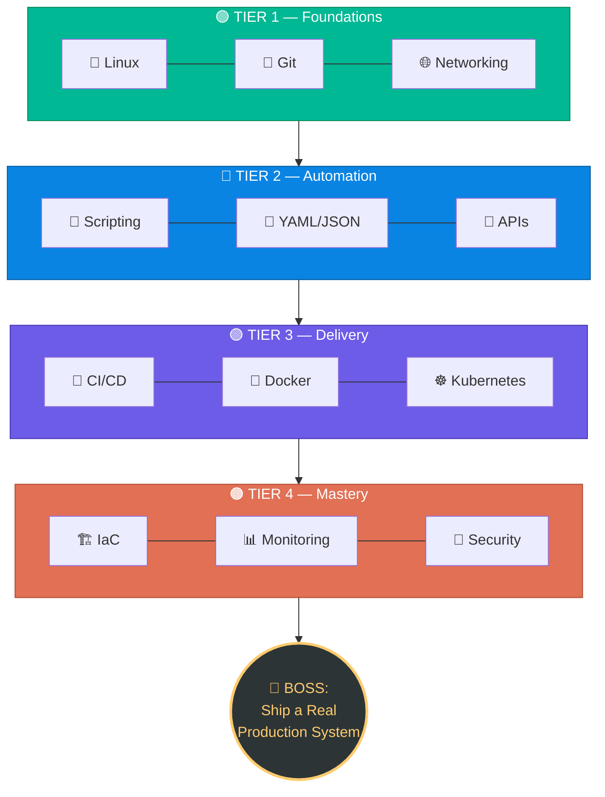
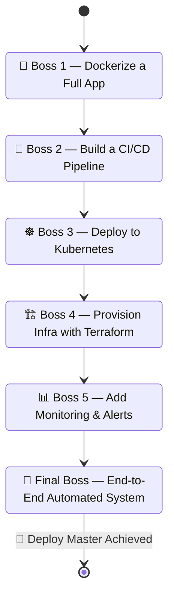

<div align="center">

# 🎮 DevOps Quest
### *Level up from Noob Ops to Deploy Master*


*A gamified guide to becoming a DevOps engineer — treat every tool as a skill,*
*every stage as a level, and every real project as a boss fight.*

</div>

---

## 🧙 The Premise

You start as a **Script Kiddie** with a terminal and a dream. Nine levels stand between
you and the title of **Deploy Master**. Each level unlocks new abilities. Skip a level
and the boss fights later will destroy you. This is the way.



---

## 🗺️ The Skill Tree

Instead of a straight line, think of this as an RPG skill tree — some branches
you can grind in parallel, others gate the next tier.



---

## 🏆 Levels & XP Table

| Lvl | Class Title | Unlocks | XP to Clear |
|:---:|---|---|:---:|
| 1 | 🧑‍💻 **Script Kiddie** | Linux, Bash, basic Git | 500 |
| 2 | 🔍 **Terminal Novice** | Networking basics, GitHub flow | 500 |
| 3 | 🐍 **Automator** | Python/JS, YAML, JSON, REST APIs | 800 |
| 4 | 🔁 **Pipeline Apprentice** | Jenkins / GitHub Actions / GitLab CI | 1000 |
| 5 | 🐳 **Container Tamer** | Docker, Docker Compose | 1000 |
| 6 | ☸️ **Orchestrator** | Kubernetes, cloud (AWS/Azure/GCP) | 1500 |
| 7 | 🏗️ **Infra Architect** | Terraform, Ansible | 1200 |
| 8 | 📡 **Observability Mage** | Prometheus, Grafana, logging/alerts | 1000 |
| 9 | 🛡️ **Security Sentinel** | Secrets mgmt, DevSecOps, access control | 1200 |
| 🏁 | 👑 **Deploy Master** | *Real-world project + interview boss fight* | 300 |

**Total XP to Deploy Master: 9000**

---

## ⚔️ Boss Fights (Real Projects)

Each boss fight is a project that forces you to combine everything learned so far.
No boss, no level-up — theory alone won't save you.



| Boss | Victory Condition |
|---|---|
| 🐳 Dockerize a Full App | App runs identically on any machine via `docker compose up` |
| 🔁 Build a CI/CD Pipeline | Push to `main` → auto build, test, deploy — no manual steps |
| ☸️ Deploy to Kubernetes | App survives a pod being killed, with zero downtime |
| 🏗️ Provision Infra with Terraform | Entire environment rebuilt from code in under 10 minutes |
| 📊 Add Monitoring & Alerts | You get paged *before* a user complains |
| 👑 Final Boss | A stranger could deploy your project from the README alone |

---

## 🎒 Your Inventory (Tool Loadout)

<table>
<tr>
<td valign="top" width="33%">

**⚙️ Core Kit**
- Linux / Bash
- Git & GitHub
- Python or JS

</td>
<td valign="top" width="33%">

**🚚 Delivery Kit**
- Docker
- Kubernetes
- CI/CD platform of choice

</td>
<td valign="top" width="33%">

**🛡️ Endgame Kit**
- Terraform / Ansible
- Prometheus / Grafana
- Secrets manager

</td>
</tr>
</table>

---

## 📜 Quest Log (Repo Structure)

```text
devops-quest/
├── README.md
├── 📓 quest-log/        # notes per level
├── 📚 scrolls/          # PDFs & study material
├── 🎞️ tomes/            # slides & presentations
└── ⚔️ boss-fights/      # real projects, one folder per boss
```

---

## 🧾 Rules of the Quest

1. **No skipping tiers.** Kubernetes without Docker is a boss fight you will lose.
2. **XP only counts if you build something.** Watching tutorials is not grinding.
3. **Break things on purpose.** You learn more from a failed deploy than a smooth one.
4. **Document as you go.** Your `quest-log/` is future-you's cheat sheet.
5. **The final boss is an interview.** Practice explaining *why*, not just *how*.

---

<div align="center">

### 🕹️ Status: `Level 1 — Script Kiddie`
### Next Unlock: 🐧 Linux Fundamentals

**Your terminal awaits. Press Start.**

</div>\